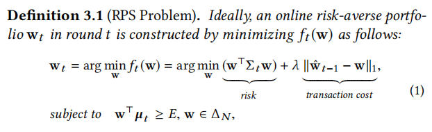
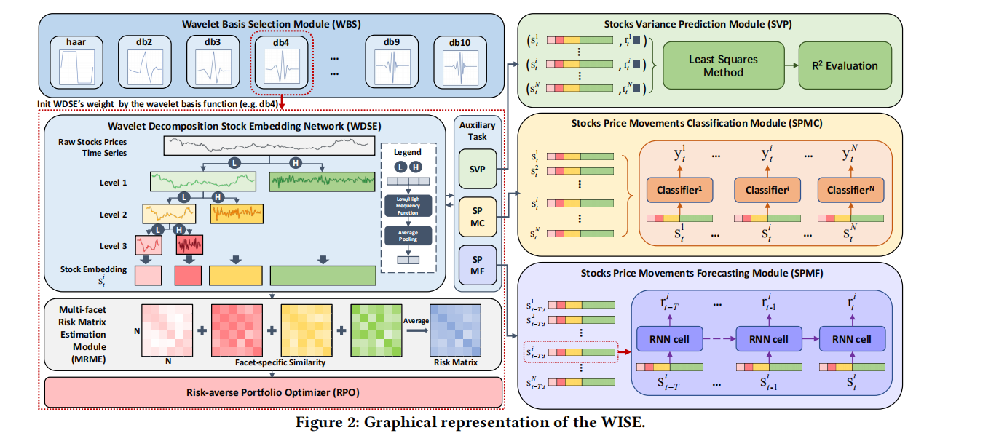

> [!TIP|label:近况]
> 上周五生病了，一直发烧到前天才稍微好点。然后就是我把模型改吧改吧，把注意力模块加入了那个频率+LSTM的模型之后，模型的效果不够好。然后又试了试把ff5因子数据加入模型，试图以此提供额外信息，发现效果仍然一般。
> 所以今天又尝试性的看了一篇别的文章，看看能不能有所启发。还没看完。
# 基于小波的投资组合管理
> 'WISE: Wavelet based Interpretable Stock Embedding for Risk-Averse Portfolio Management'   WWW 2022
## 摘要
本文提出了一种基于小波分解的RPS(risk-averse portfolio selection)方法，该方法不仅从时域和频域的角度充分利用了股票时间序列，而且具有从不同频率角度提供投资组合决策可解释性的优势。此外，在'WISE'模型中，我们设计了一个理论保证的小波基选择机制和三个辅助增强任务，分别自适应地寻找合适的小波参数，提高了股票嵌入的表示能力。在三个真实数据集上进行的大量实验表明，WISE在回报和风险方面优于最先进的投资组合选择方法。此外，我们还对计算出的投资组合风险矩阵进行了定性分析，以表明从不同频率角度对计算出的风险程度的可解释性。
## 主要贡献
> [!NOTE|label:注意]
>股票嵌入(stock embedding): stock embedding 通过将股票映射到向量空间中，使得模型可以更好地理解不同股票之间的关联、相似性或者其他特征（比如变化相近的股票，embedding之后空间举例就会变近）。这种映射通常是通过网络学习得到的。
本文提出了一种新的RPS方法WISE来构建风险厌恶投资组合。不同于传统的风险矩阵（协方差）估计，WISE分解风险矩阵估计分为两个步骤： 
- (1)基于小波分解来构造股票嵌入以自适应地从多个频域把握股票之间的关系 
- (2)可解释的从基于股票嵌入的时间和频域的角度估计风险矩阵。
最后，WISE基于该风险矩阵构建了每轮交易中的‘风险规避投资组合’。在WISE中，我们设计了一个理论保证的小波基选择模块来选择小波基函数和一种新的小波分解股票嵌入网络来微调滤波器系数，这两种方法都可以解决小波参数难找的问题。
为了解决风险矩阵的未来趋势很难反映的问题，我们另外建立了三个辅助任务，即股票方差预测、股票价格变动分类和股票价格变动预测，它们可以提高股票嵌入的表示能力，以反映股票价格的未来趋势。

## 问题建模
### RPS问题

> $\Delta_N = \{0<=W<=1 \space\& \space\sum W =1\}$ 

这里是金融领域马科维兹投资组合理论中的优化式子，可以被描述为一个在线凸优化的问题（online convex optimization）。这里也是整个RPS优化问题的核心，即在满足收益不小于 $\E$ 的情况下，使得风险最小。（或者风险不大于某R的情况下，收益最大）
> 马科维兹投资组合理论 https://zhuanlan.zhihu.com/p/649620171
### 模型架构

WISE由四个关键模块组成: 小波基选择（WBS）模块、小波分解股票嵌入（WDSE）网络、多面风险矩阵估计（MRME）模块和风险厌恶投资组合优化器（RPO）。WISE的图形表示如上图所示。

具体来说，使用WBS模块和WDSE网络来构建股票嵌入，即构造不同的频域特征。此外，我们还引入了股票方差预测、股票价格变动分类和股票价格变动预测这三个辅助任务，以增强股票嵌入表示。MRME模块利用相似度来估计不同频域下的相关矩阵，并汇总相关矩阵来计算风险矩阵。RPO在两种投资条件下，基于风险矩阵将投资组合的风险最小化，即交易成本与投资组合回报超过预期回报之间的权衡，构建风险厌恶投资组合。稍后我们将详细介绍这四个模块和辅助任务
#### 小波分解股票嵌入 WDSE模块
> [!TIP|label:背景]
> 离散小波变换：https://gitcode.csdn.net/65e934ab1a836825ed78d2d8.html
> DWT变换的主要思想是利用小波基函数对信号进行分解。小波基函数具有可缩放性，即可以根据不同尺度的需要来生成不同大小的小波基函数。在DWT中，常用的小波基函数有哈尔小波、Daubechies小波、Mexican hat小波等。
> DWT变换的基本过程如下：
> - 将原始信号进行低通滤波和高通滤波，得到两个子信号，即近似系数和细节系数；
> - 对近似系数进行递归分解，得到若干个尺度下的近似系数和细节系数；
> - 通过对细节系数进行递归分解，得到若干个尺度下的细节系数；
> - 重构原始信号时，将不同尺度的近似系数和细节系数进行合并，得到重构后的信号。
> 最后得到的结果就是，很多个level的小波系数。

--                    
#### 小波基选择模块 WBS模块
--
<!-- 
## 一些基本定义

### Contingent Claims（状态资产）

Contingent claims 的中文学名并不直观，我们这里用它的直观含义来称呼它 &mdash; <strong>状态资产，即 contingent claims 是在未来某一个状态下有 1 块钱回报而在其他状态下回报为 0 的资产。</strong>

假设未来的状态空间 $\mathcal{S}$ 中有 $S$ 个状态（$S < \infty$）。一个在状态 $s$ 下有 1 块钱回报的状态资产价格为 $pc(s),\ s \in \mathcal{S}$。那么一个回报为 $x$ 的资产价格可以表示为
f
$$
\begin{equation}
    p(x) = \sum\limits_{s \in \mathcal{S}} pc(s) x(s) \label{1}
\end{equation}
$$

其中 $x(s)$ 代表这个资产在状态 $s$ 下的回报。

假设状态 $s$ 发生的概率是 $\pi(s)$，我们可以把 $\eqref{1}$ 式写成期望的形式：

$$
\begin{align}
    p(x) &= \sum\limits_{s \in \mathcal{S}} pc(s) x(s) \notag \\
    &= \sum\limits_{s\in \mathcal{S}} \pi(s) \frac{pc(s)}{\pi(s)} x(s) \notag \\ 
    &= \E_{\mathcal{S}}\left[\frac{pc(s)}{\pi(s)} x(s) \right] \label{2}
\end{align}
$$

### SDF（随机折现因子）

定义 $m(s) = \frac{pc(s)}{\pi(s)}$，由 $\eqref{2}$ 式我们得到了定价公式

$$
\begin{equation}
    p = \E(m x)
\end{equation}
$$

> [!NOTE|label:注意]
> 这里将 $\E_{\mathcal{S}}(\cdot)$ 简写为 $\E(\cdot)$，将 $m(s)$ 和 $x(s)$ 简写为 $m$ 和 $x$。

我们称 <strong>$m$ 为随机折现因子（Stochastic Discount Factor，SDF），因为它是将回报 $x$ 折现回价格 $p$ 的随机变量。</strong>SDF 这个随机变量在状态 $s$ 下的取值为 $m(s)$。

### 风险中性概率

如果存在无风险资产，即在任何状态都可以获得 1 块钱的回报，那么它的价格就应该为 $\E(m)$，总收益率（gross return）为 $R_f = \frac{1}{\E(m)}$。**在风险中性的测度下，额外的风险并不会带来额外的回报**，记为 

$$
\begin{equation}
    \E^{*}(R) = \frac{\E^{*}(x)}{p} = R_f = \frac{1}{\E(m)}
\end{equation}
$$

其中 $\E^{*}(\cdot)$ 代表风险中性测度，$R$ 是某个回报为 $x$，价格为 $p$ 的资产的总收益率。

由此我们可以得到风险中性概率 $\pi^{*}$ 的定义：

$$
p = \E(m) \E^{*}(x) = \E(m) \sum\limits_{s \in S} \pi^{*}(s) x(s) = \sum\limits_{s \in S} \pi(s) m(s) x(s)
$$

$$
\begin{equation}
    \implies \pi^{*}(s) = \frac{m(s)}{\E(m)} \pi(s)
\end{equation}
$$

## 从几何的角度理解定价

我们已经从代数的角度定义了资产定价中的一些基本概念，这些概念可以用另一个角度来看待 &mdash; 几何。从几何的角度可以方便我们去更进一步地理解定价。

### 用向量表示随机变量

以状态为维度，我们可以将随机变量在不同状态的取值组合成一个向量。比如回报 $x$ 可以表示为

$$
x = \begin{bmatrix} x(s_1) \\ x(s_2) \\ \vdots \\ x(s_S) \end{bmatrix}
$$

### 回报空间

#### 完备市场下的回报空间

完备市场需要满足以下两个条件：

1. 交易费用忽略不计；
2. 每个资产在每个状态 $s$ 下都有一个价格 $p(x;\ s)$。

假设市场是完备的，那么所有状态资产都存在，即我们可以定义回报空间 $\underline{X} = \mathbb{R}^{S}$（因为我们有 $S$ 个状态），所有状态资产的回报可以看作是回报空间中的一组标准正交基。

> 这里应该有张图。

<strong>然而仅凭这个回报空间并不能表征不同状态发生的概率，也就不能定价，我们需要一个辅助的向量来更好地实现几何上的理解。</strong>定义不同状态资产的价格组成的向量为

$$
pc := \begin{bmatrix} pc(s_1) \\ pc(s_2) \\ \vdots \\ pc(s_S) \end{bmatrix}
$$

根据无套利，随机变量 $m$ 应该大于 $0$，也就是 $m$ 在各个状态的分量 $m(s) > 0$，则 $pc(s) = m(s) \pi(s) > 0$，因此 $pc$ 在回报空间中可以表示为一个指向第一象限的向量。

> 这里应该有张图。

根据 $\eqref{1}$ 式，资产价格可以通过将回报投影到 $pc$ 上得到，即

$$
\begin{equation}
    p(x) = pc \cdot x = \left\vert pc \right\vert \left\vert x \right\vert \cos(\theta) \label{6}
\end{equation}
$$

其中 $\cdot$ 代表向量点乘（内积），$\left\vert \cdot \right\vert$ 代表向量的模长，$\theta$ 是 $pc$ 与回报 $x$ 之间的夹角。

> [!TIP|label:提示]
> 由此我们知道，**相同价格的回报投影到 $pc$ 上会具有相同的长度**：$\left\vert x \right\vert \cos(\theta) = \frac{p(x)}{\left\vert pc \right\vert}$。

考虑以下两种特殊情况：

- 超额收益率：价格为 $0$

    - 根据 $\eqref{6}$ 式，$p(x) = 0$ 代表超额收益率与 $pc$ 的内积为 $0$，即**任意超额收益率在回报空间中都应该与 $pc$ 正交。**

    > 这里应该有张图。

- 总收益率：价格为 $1$
    - 根据 $\eqref{6}$ 式，$p(x) = 1$ 代表总收益率与 $pc$ 的内积为 $1$，即任意总收益率在 $pc$ 上的投影长度都为 $\frac{1}{\left\vert pc \right\vert}$。

    > 这里应该有张图。

#### 不完备市场下的回报空间

现实中的市场是不完备的，除了有交易费用外，也并不是所有状态都存在状态资产。因此，在市场不完备的情况下，回报空间并不是 $\mathbb{R}^{S}$，而是它的一个真子集，记为 $\underline{X} \subsetneqq \mathbb{R}^{S}$。

我们**要求回报空间对线性运算是封闭的，即投资者可以通过构造投资组合得到新的回报**，数学定义如下：

$$
x_1,\ x_2 \in \underline{X} \implies a x_1 + b x_2 \in \underline{X},\quad \forall a,\ b \in \mathbb{R}
$$

> [!NOTE|label:注意]
> 在[完备市场下的回报空间](#完备市场下的回报空间)我们并没有额外做这个要求，是因为 $\mathbb{R}^{S}$ 本来就满足线性运算封闭。

当然，现实中投资者可能面临其他的交易限制，比如卖空限制、买卖价差、杠杆限制等等，这些限制都可以通过对回报空间做要求来满足。

### 价格与 SDF 的性质

我们已经定义了回报空间，但想要定价，还需要知道价格与回报之间的关系。

**价格可以看作是从回报空间到实数空间的一个映射，记为 $p: \underline{X} \to \mathbb{R}$。一价定律告诉我们，这个映射是线性的**，数学定义如下：

$$
p(a x_1 + b x_2) = a p(x_1) + b p(x_2),\quad \forall a,\ b \in \mathbb{R}
$$

> [!NOTE|label:注意]
> 线性映射不代表 $p$ 是 $\underline{X}$ 的线性函数，线性函数从映射角度讲应该称作**仿射映射（affine map）**，即线性映射 + 平移（截距）。

如果存在 SDF，那么显然一价定律是满足的：

$$
\E[m (a x_1 + b x_2)] = a \E(m x_1) + b \E(m x_2)
$$

> [!NOTE|label:注意]
> 在几何的框架下我们会把回报 $x$ 看作向量，而在代数的框架下我们会把它看作随机变量。

但满足一价定律是否能推出 SDF 存在呢？假设回报空间 $\underline{X}$ 由 $N$ 个基础回报张成（$N$ 个个股），这组基和他们对应的价格分别记为

$$
x = \begin{bmatrix} x_1 \\ x_2 \\ \vdots \\ x_N \end{bmatrix},\ 
p = \begin{bmatrix} p_1 \\ p_2 \\ \vdots \\ p_N \end{bmatrix}
$$

这里 $x$ 中每个元素都是一个随机变量。则回报空间可以表示为 $\underline{X} = \left\{c' x \right\}_{c \in \mathbb{R}^{N}}$。

## References

Cochrane, J. H. (2009). Asset pricing (Rev. ed). Princeton University Press. -->