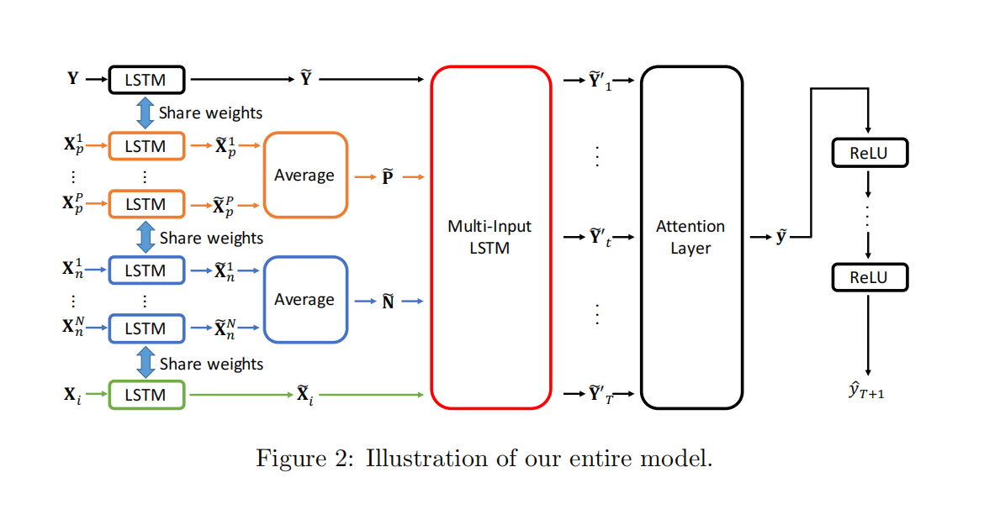
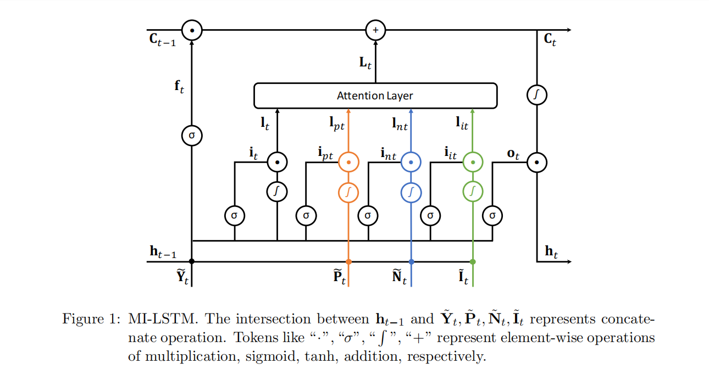

# 多变量输入的LSTM + Attention机制
**"Stock Price Prediction Using Attention-based Multi-Input LSTM" ACML 2018**
## 摘要和动机
>在本文中，提出了一种新的多输入LSTM模型，该模型能够从低相关因素中提取有价值的信息，并利用额外的输入门，丢弃其有害噪声。还引入了几个新的因素，包括其他相关股票的价格，以提高预测精度。
通常，在因子与或其他特征与股票趋势的相关性较弱的时候，把所有特征全部放入神经网络或者线性回归会对预测有害，它们所带来的信息难以抵消它们带来的噪音。为了解决这个问题，作者提出了一种新颖的多输入LSTM单元，旨在区分主要因素和辅助因素。这种设计通过**分别控制输入门**来处理主要因素和辅助因素，其中输入门的控制依赖于主要因子状态和先前的隐藏状态。这样做的目的是通过过滤主要和辅助因素的数据，生成将要融合更新单元状态的记忆单元输入。
## 主要贡献
本文的主要贡献总结如下：
1. 我们发现了相关股票的潜在用途，并利用相关股票的股票价格来预测目标股票的未来价格。
2. 我们提出了一种新的MI-LSTM模型，该模型使主流模型能够决定其他因素的使用，并对不同的记忆单元输入和不同时间步长的隐藏状态采用双阶段注意机制，以提高预测精度。
3. 我们将我们提出的模型与各种最先进的模型进行了比较，以评估MI-LSTM对来自中国股票市场的股票数据的有效性。MI-LSTM在均方误差（MSE）方面比LSTM提高了9.96%。
## 问题建模
$Y=\{y_1,y_2,y_3...y_t\}$是目标股票的价格历史序列。
$X=\{x_1,x_2,x_3...x_t\}$是目标股票的相关因子的历史序列
因此，利用X，Y来预测未来的股价
$$y_{t+1}=F(X,Y)$$
其中F是我们需要学习的对应映射。对于lstm模型来说，最后的预测输出就是最后一个h的简单变换。
### 模型建构
模型对不同类型的股票进行了分类，共有100只候选。对于每一个目标股票而言，他都计算了它相对于市场上的主要其他99个股票的相关系数，然后分别将相关系数最+的20只分配到Positive，也就是$\hat{P}$。将相关系数最-的20只分配到Negative，也就是$\hat{N}$。将于市场其他有关的时间序列（比如指数收益、公司特征、因子特征）等放入$\hat{I}$集合中。然后利用LSTM分别提取三类时间序列的特征。
 

上图中表示将不同类型的时间序列分别放入lstm，得到了每个类别的序列特征，分别是目标股、正相关股P、负相关股N、市场因子I。再经过attention层赋予权重，加权之后最后放进一个LSTM中再次预测。此处的multi_input_lstm层和attention层是嵌套的，不是先后关系。具体看下图

这个图更清晰的反映了关系，其实就是将原本LSTM的输入门的输入变量，从只有序列本身，拓展到了多变量输入，并且利用attention来综合了输入。其他的其实就是一个大型的LSTM。

> [!TIP|label:思考]
>这里找到了一个新的将多变量序列的信息结合进LSTM的方法，给我之前改动找到了一些启发，我之前想的改进频率那个LSTM的模型，加入市场因子等，效果都很不好，这里再试试，这样综合进去会不会更好。
