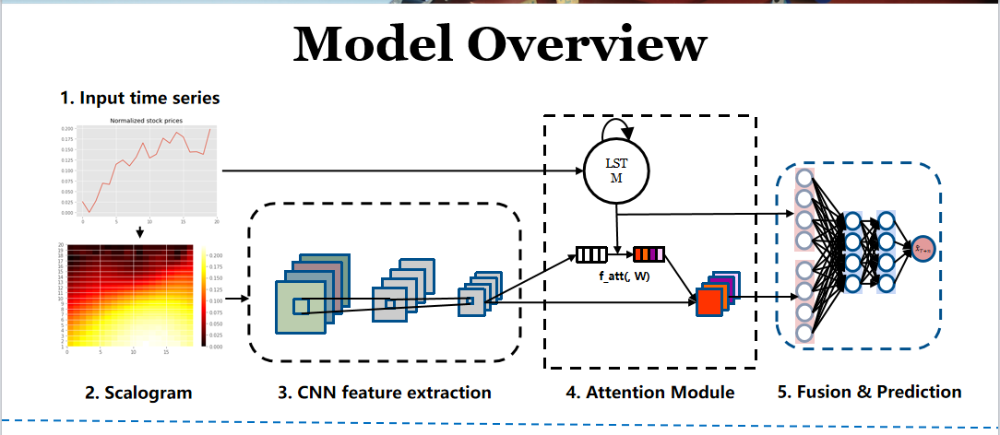
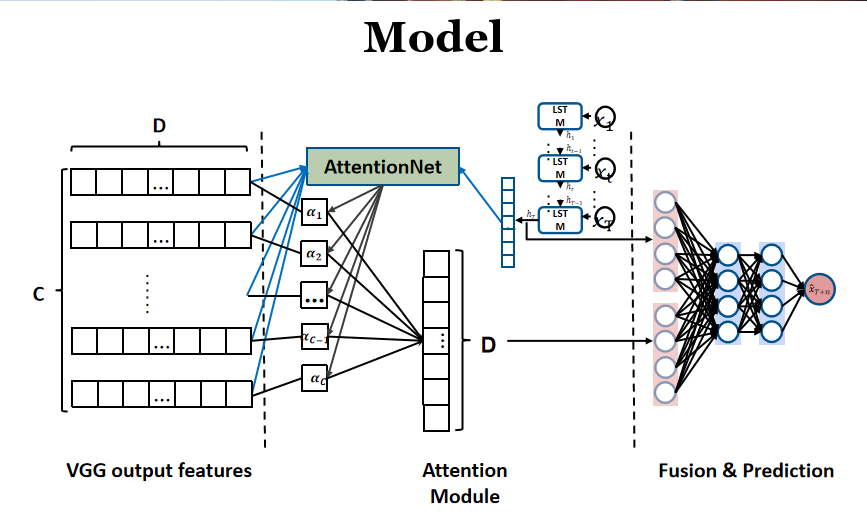
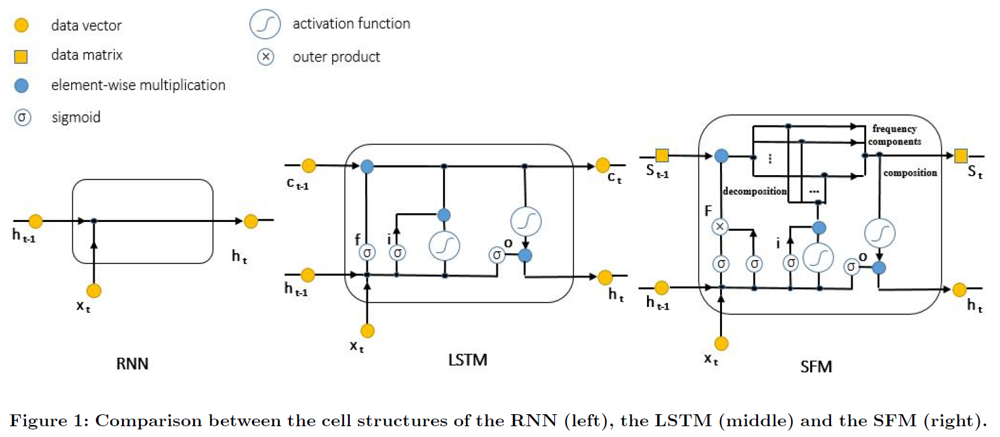

# Wavelet + Attention + LSTM
"Forecasting Wavelet Transformed Time Series with Attentive Neural Networks"
>本文将时间序列信号分解为其**时频表示**—小波时间频率图，明确地揭示单变量时间序列的频域信息，以提高预测精度。
>基于转换后的数据，利用不同的神经网络同时捕获**局部时频**特征和**全局长期趋势**。
>进一步利用**注意机制**，有效地融合了局部特征和全局特征。实时序列的实验结果表明，该方法比各种基线方法具有更好的性能。

1. 具体来说，就是先把时间序列先分解为小波变换图，然后利用卷积神经网络（CNN）来学习到小波频谱的特征，得到一系列特征向量$X=\{x_1,x_2...x_c\} \in \mathbb{R}^c$。

2. 再将原序列放入lstm里面跑，得到一系列隐藏状态，里面包含了原序列中的趋势信息。我们取lstm的最后一个隐藏状态$h_T$

3. 然后将$X$和$h_T$同时放入attention层里面(这里用的是MLP做的Attention)，求得每一个$x_i$特征的得分，最后将加权后的特征向量求和得到$ Z \in \mathbb{R}^c$。
$$
\begin{align}
&e_i=W_2\space \sigma(W_1\space [x_i|h_T]+b_1)+b_2\\
&\alpha_i=\frac{exp(e_i)}{\sum_{k=1}^C exp(e_k)}\\
&Z=\sum\limits_{i=1}^{n} x_i \alpha_i  \space
\end{align}
$$

>$\sigma$是激活函数，$W_1,b_1$是注意力层（多层感知机）第一层的参数，$W_2,b_2$是第二层参数 $\alpha$是特征重要性占比。Z是各特征赋予权重之后的值。$ Z \in \mathbb{R}^c$。

4. 最后将$Z$与$h_T$再次放入多层感知机中，得到预测值。

5. loss函数就是用的MSE加上一个参数的L2正则。

>
>
>上图是整个模型的架构.

> [!NOTE|label:小波变换]
>下面是小波频谱的示例，意思就是某序列在不同时间（time）的时候，不同尺度（scale）的波含量是多少。小波函数的基是 $\bm{f(time，scale)}$，Amplitude代表在该序列上（time，scale）形状的小波含量多少。
>

> [!TIP|label:思考]
> 1. 我将上次的SFM的model里面，加入股票多因子的attention，用来选择SFM的10个不同的频率通道哪个更重要。正在测试代码中，还没跑通模型[LSTM + Frequency](Multi-Frequency_Trading_Patterns_LSTM.md) 
>
> 2. 然后我正在看一篇神经网络的可解释性的文章，可以判断是哪些神经元起作用，可以借此来判断模型风险''WISE: Wavelet based Interpretable Stock Embedding for Risk-Averse Portfolio Management''
>
> 3. 找到一篇编码股票之间相关性的文章，还没看，尝试将不同的股票的走势关联起来，然后预测。''Accurate Multivariate Stock Movement Prediction via Data-Axis Transformer with Multi-Level Contexts''

